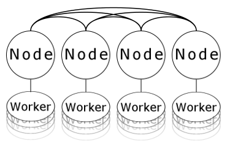

# AutoMPI


# Distributed Service Platform #
### real-time data processing service platform in Go

The purpose of this platform is to process large amounts of real-time data flows by working with data in atomic collections across multiple devices.

##### Nodes act as a host for workers.
##### Workers act as agents for the data.
##### The state of data is private to the worker.

Nodes provide an easy to use interface to the cluster to the workers. Removing the need for a worker to know where a recipent of a message is and how to deliver the message to the destination. Distributing workers across Nodes to balance workloads over a spread of devices and minimising data traffic through passing messages to relavant workers only.

The greater application is essentially defined by the Workers

Inside the DoWork() method the worker process any messages that it has queued and then the internal workload. New data for a worker could delivered to it internally through a message or the worker could retrieve it from an external store. When the worker is finished with a data set then it could either be posted back as a message or back to an external store

In this model there is essentially 2 options for when data is to be picked up to be processed, either on delivery of a message or periodically in the DoWork() method. In the case of the ExampleWorkerIPCamera, its 'work' is to retrieve an image from an IP camera. This is done within the load of the DoWork() method, but any task could be the workload of the DoWork() method.


Features implemented
* Autodiscovery of local Nodes
* Establish links between Nodes
* Cleaning of broken links
* passing of JSON Messages 
* Node / Worker ( Host / Agent ) archicture 

Example workers
* WorkerTemplate
* WorkerExampleIPCamera
* WorkerExampleKeyValueStore (ytbi)
* WorkerExampleScheduler (ytbi)

## How To use 

Create a Node of the AutoMPI

```Go
node := CreateNode(
	"NodeGUID00001", // GUID of this node
	"192.168.1.20",  // Local address of this node
	msgHandler)      // An external message handler
```

more message handlers can be attached with the attach function.
```Go
node.AttachExternalMessageHandler(msgHandler)
```

Message handler declaration
```Go
func msgHandler(Message AutoMPI.MapMessage, node *AutoMPI.Node) {}
```

## Workers 

Workers follow the IWorker interface 

```Go
type IWorker interface {
	// Get the guid of this worker
 	GetGUID() string
 	// add a message to this workers queue
 	QueueMessage(MapMessage)
 	// attache the AutoMPI.Node.Send(func(MapMessage)) method to this worker
 	AttachSendMethod(func(MapMessage))
 	// do work, passing the nanoseconds since the last call
 	DoWork()
 	// close the worker
 	Close()
 	// get the age of the worker
 	GetAge() string
}
```
An example worker be found in the 'WorkerTemplate.go' code file

Once the Node is running workers can be attached with the attach method

```Go
node.AttachWorker(AutoMPI.CreateWorkerTemplate("TemplateWorker0001"))
```


## AutoMPI Messages 

at the core of AutoMPI are messages which act both as commands but also to move data.
Only the DestinationGUID of the message needs to be initialized for a message to be sent. 

```Go
type MapMessage struct {
	DestinationGUID string
	SourceGUID      string
	Message         map[string]string
	Data            []byte
}
```


The primary methods used on a node are the AutoMPI.Node.Send(MapMessage) and any attached message handler(s)


```Go
AutoMPI.Node.Send(MapMessage) 
// to send messaes (commands) to other nodes/workers
func msgHandler(Message AutoMPI.MapMessage, node *AutoMPI.Node) {} 
//to receive messages (commands) from other nodes/workers
```

Messages are checked(and passed) in this order when received by a node
* AutoMPI system message
* Worker Message
* Mode Message (Passed to external message handler(s))


